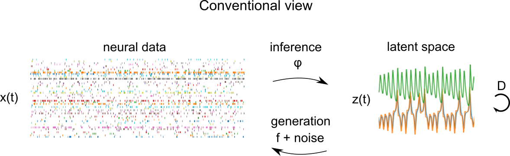
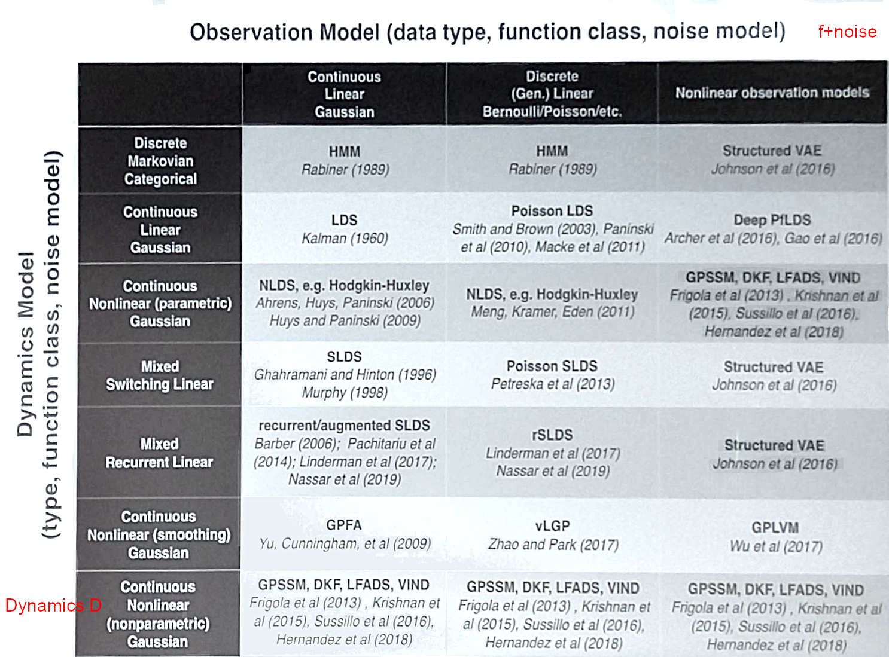
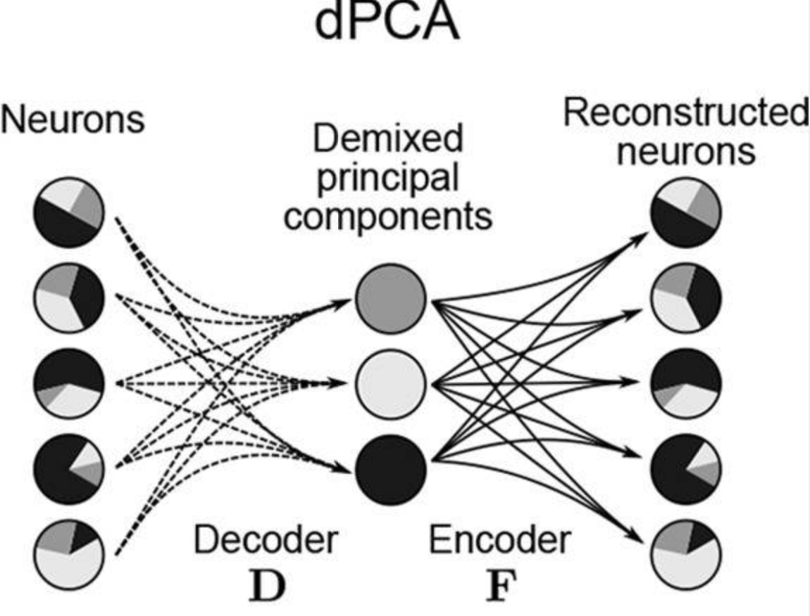
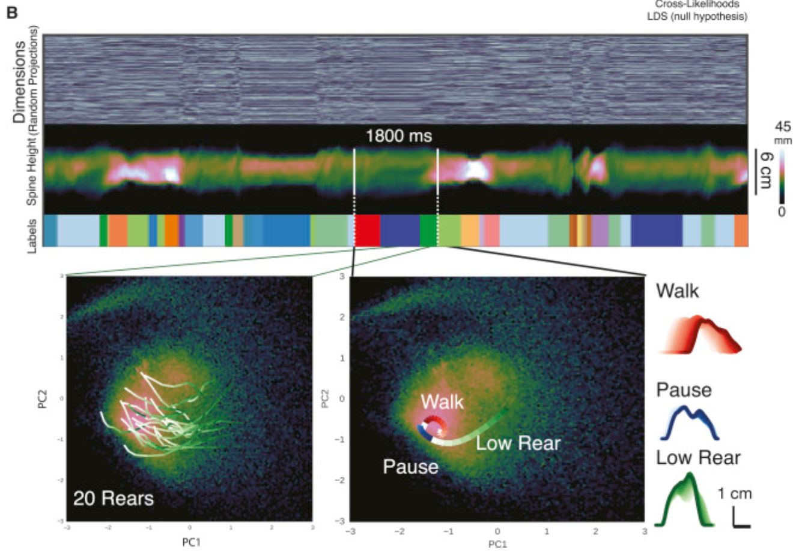
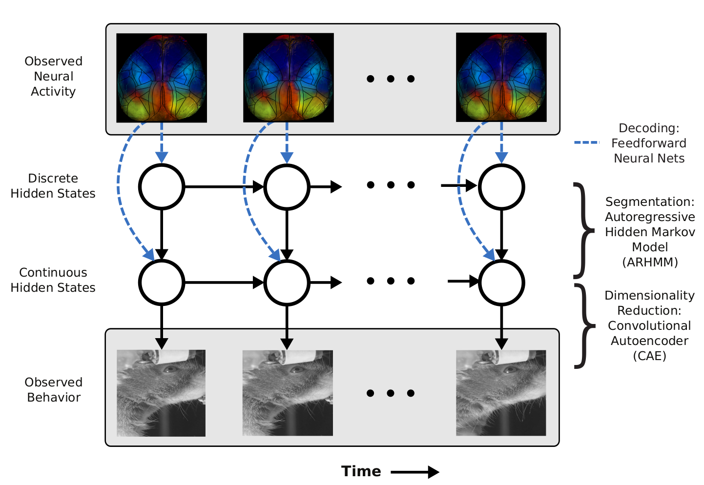

# Dimensionality reduction in neural data analysis

It's become commonplace to record from hundreds of neurons simultaneously. [If past trends extrapolate](https://xcorr.net/2021/04/27/accelerating-progress-in-brain-recording-tech/), we might commonly record 10k neurons by 2030. What are we going to do with all this data? 

> To deal with a 14-dimensional space, visualize a 3D space and say *fourteen* to yourself very loudly. Everyone does it. -- Geoffrey Hinton

Neural dynamics tend to be lower-dimensional than the number of neurons recorded would suggest - [Humphries (2020)](https://arxiv.org/abs/2011.08088) reports 10X to 100X compression depending on the area and task. Humphries suggests, with the strong principle of neural dimensionality reduction, that dimensionality reduction can show us the *true* underlying signal embodied by the neural circuit. Here, I follow more agnostic route of the weak principle: that the smaller, temporally smoother, and less noisy subspace can be easier to understand than the raw data. 

Here, I present taxonomies of unsupervised methods in neural data analysis, identify some exciting trends in the literature, and show some key gaps - a research roadmap for the next few years. 

## Goals

Why do we care about dimensionality reduction in neuroscience? Let's count the ways (roughly sorted by ambition):

- Compression: there are practical computational reasons to compress the data down to a few dozens of dimension rather than a few hundreds - i.e. to save memory and processing.
- Visualization: humans are not good at visualizing more than 2 or 3 dimensions. Compressing information down to a handful of meaningful dimensions makes it more feasible to plot them, and understand the factors of variations in the data visually.
- Denoising: if we want to understand what happens during single trials, we need to denoise the data. If 100 neurons are 100 independent manifestations of the same latent variable, we can boost the signal-to-noise ratio by a factor $\sqrt {100}$ by averaging. Dimensionality reduction flexibly averages from multiple overlapping realizations of the same data to achieve a boost in signal-to-noise ratio.
- Generate fake data: many dimensionality reduction methods are valid generative models, and we can use them generate fake neural data, for instance to benchmark spike sorting and calcium imaging signal processing pipelines. 
- Relating to behaviour: the noisy, high-dimensional neural data is hard to relate to the behaviour of the animal, which is often what we care about in the end. Compressing the info into to a lower-dimensional subspace makes it easier to relate to the behaviour. Predicting behaviour 
- Untangling latent factors: we often want to identify latent factors which *cause* the variation in the data. Most dimensionality reduction methods don't directly capture causal mechanisms - meaning that each logical dimension may capture several causal mechanisms. But some dimensionality reduction methods *aspire* to untangle independent causes - with linear ICA (independent component analysis) perhaps being the most well known example. (Standard disclaimer: causal inference is hard. Be skeptical of causal claims. This is an active area of research.)
- Understanding computation: the latent space may represent interesting aspects of the neural computation invisible in the raw data, for example, line attractor or rotational dynamics. The dimensionality-reduced latent space can help uncover those hidden computations.

# The models

Given these diverse analysis objectives, we can compile a canonical model which covers a wide range of dimensionality reduction techniques. 

*Figure uses assets from [Elephant](https://elephant.readthedocs.io/en/latest/) documentation, released under BSD-3*

Conceptually, we have a generative model which maps latent factors $z(t)$ to neural observations $x(t)$ via a mapping function $f$ and a noise model. The latent factors evolve according to their dynamics $D$. A central goal of the dimensionality reduction technique is learn an inference function $\varphi$ which maps neural observations $x(t)$ to latent factors $z(t)$. This inference function could be as simple as matrix multiplication or as complex as an implicit function implemented by a multi-step optimization procedure. 

To place some stakes in the ground, let's see how these different components interact in some popular models that you might have heard of:

* PCA: In Principal Component Analysis (PCA), the mapping function $f$ is an instantaneous linear function and the noise is Gaussian (in the probabilistic extension of PCA). The dynamics are not explicitly modeled. The inference function is the matrix inverse of the mapping function
* ICA: In Independent Component Analysis (ICA), the class of mapping functions is the same as in PCA, but during learning, the mapping function $\varphi$ is constrained that the latent space $z(t)$ is factorized into independent sources.
* GPFA: In Gaussian Process Factor Analysis (GPFA), the mapping function is again a linear function followed by Gaussian noise, but now the dynamics are explicitly modeled using a independent Gaussian Process (GP) prior. You can think of this as imposing that the latent variables vary smoothly over time. The inference is done through closed form GP inference with Expectation Maximization to learn the hyperparameters
* LFADS: In Latent Factor Analysis via Dynamical Systems (LFADS), the dynamics are given by an RNN, while the mapping function is linear and the noise can be Gaussian or Poisson. The RNN implicity imposes smooth dynamics. Inference is done via variational inference in a variational autoencoder (VAE) framework.

Perhaps the most important moving piece is the dynamics. To infer the latent structure of neural activity at a single trial level, with currently existing recording technology, there just isn't enough neurons and SNR to infer latents at a single-trial level: we have to flexibly smooth through time. Complex dynamics priors require sophisticated, probabilistic methods for inference - each with their tradeoffs in terms of speed, simplicity of implementation, and generality - which is why we've seen an explosion of methods in the last 5 years. 

# Taxonomies

Now that we've seen some examples of dimensionality reduction methods in the wild, let's look at some published taxonomies that try to bring some order into the chaos. I've annotated these taxonomies with the components of the canonical model above for reference. An early taxonomy is in the now classic review [Cunningham and Yu (2014)](https://www.nature.com/articles/nn.3776):

We see the diversity of goals representedin this early work. Much of the research in the following years has been focused on building sophisticated new methods of inference that assume explicit generative and dynamics models. Dynamics allow models to integrate information over time, which makes it possible to do single-trial inference. John Cunningham presented a new taxonomy of these models in a talk circa 2018:

*Apologies for the low quality, it was extracted from a photo of the key slide*

With sophisticated models comes sophisticated inference techniques; [Memming Park provided an excellent summary in a 2020 CoSyNe talk](https://www.youtube.com/watch?v=AAfslStLYBo):

Many of these methods were compiled very recently into yet another taxonomy from [Hurwitz el al. (2021)](https://arxiv.org/abs/2102.01807), synthesizing some of the earlier work in this space with cutting-edge methods.

The acronyms are a bit non-descript, but you can often guess what each method is about by looking at groups of letters within the acronyms:

* GP: Gaussian Process. Gaussian processes are often used to impose temporal smoothness on latent variables, and more rarely to model nonlinear tuning curves.
* LDS: Linear dynamical system. The Kalman filter is an example of a model with an underlying linear dynamical system.
* SLDS: Switching LDS. A model which can switch between 2 or more latent linear dynamics depending on a discrete variable.
* P*: Poisson. A starting P in an acronym often refers to a Poisson noise model.
* VAE: Variational auto-encoder. A latent variable model which compresses observations to latents using an encoder down to a tractable distribution (frequently a multivariate Gaussian) and which is fit through variational inference.

## Shifts in focus

You'll notice some shifts in methods commonly used as the last decade progressed. First, there's been a steady shift to models with explicit dynamics. During inference, models with dynamics can flexibly pool (smooth) across time. We also see a radical shift in inference methods. Some of the earliest work was steeped in classic machine learning techniques. Gaussian processes (GPs) were and remain fundamental building blocks of dimensionality reduction techniques. Following 2014, we've seen the adoption of deep learning methods, RNNs, BBVI (black-box variational inference) and VAEs (variational auto-encoders). Toolboxes like tensorflow probability (tfp) and PyTorch's distributions have made variational inference increasingly accessible for this class of models.

## Behaviour shbehaviour

You'll notice that these taxonomies don't explicitly address how behaviour and experimental conditions are integrated into each model. Some of the most interesting developments in this field relate to explicitly integrating behaviour into dimensionality reduction. 

Let's consider a more general version of the dimensionality reduction model, which integrates behaviour, as well as external covariates corresponding to experimental conditions. Here, we have behaviour time series $u(t)$ which are parallel to neural time series $x(t)$. $u(t)$ could consist of time series of arm position in a reaching task, PCs of a video of a mouse's face, or experimental conditions, for example. The mapping functions and generative models now operate on the concatenation of these times series - the latent space $z(t)$ is shared between behaviour and neural data. Here, the distinction between regression of behaviour onto brain data (or vice versa) and dimensionality reduction is blurred: it's something in the middle. This is the mental model I'm using when considering the integration of behaviour and neural data, but be aware that there are a lot of different ways of integrating behaviour and neural data that look superficially different.

Here's my own little taxonomy of behaviourally-aware models:

* [LDA](https://scikit-learn.org/stable/modules/lda_qda.html#lda-qda): Linear discriminant analysis. Classic technique. Finds a set of dimensions which can maximally discriminate a set of classes. No dynamics.
* [CCA](https://en.wikipedia.org/wiki/Canonical_correlation): Canonical correlation analysis. Classic technique. Finds a common linear subspace between two different sets of matrices. Inference and mapping both down through linear functions. No dynamics
* [Demixed component analysis](https://pubmed.ncbi.nlm.nih.gov/27067378/): Performs an ANOVA-like or tensor-factorization-like decomposition of the data in terms of different levels of conditions and their interactions. No dynamics, averaged trials only.

* [LFADS](https://www.biorxiv.org/content/10.1101/152884v1): Latent factor analysis via dynamical systems. Can integrate behavioural and condition information as side information to the latent space. Single-trial, RNN dynamics, explicit noise model, variational inference (VAE).

* [PSID](https://www.biorxiv.org/content/10.1101/808154v1): Preferential subspace identification. Kalman-filter-inspired model which explicitly partitions the latent space into behaviour-only, neural-only, and neural-and-behaviour subsets. Single trial, linear dynamics, gaussian noise model, Kalman-filter-based inference (dynamic programming).

* [pi-VAE](https://arxiv.org/abs/2011.04798): (not covered in other reviews, published late 2020). Poisson interpretable variational auto-encoder. Embeds the latent information about conditions and behaviour as part of a VAE-like hierarchical generative model. Inspired by recent work fusing nonlinear ICA and VAEs ([Khemakhem et al. 2019](https://arxiv.org/abs/1907.04809)), uses flexible injective functions (GIN, a variant of RealNVP) as generative models to untangle latent causes (up to permutations). No dynamics.

## Exciting trends

### Behaviour

As you might have surmised from the previous paragraph, I'm excited to see the progress in models which explicitly integrate behaviour. Dimensionality reduction algorithms are often sanity-checked on known low-dimensional systems - e.g. the Van der Pol oscillator, the Lorenz system, balanced E-I networks. When they're deployed in the wild, however, evaluating them often boils down to matching them to known behaviour and experimental conditions. In essence, the behaviour *is* the ground truth. In this context, it is a missed opportunity to not explicitly model behaviour. 

Behaviour is already being modeled with dimensionality reduction methods which are very similar to the ones used for neural data. In an influential study, [Wiltschko et al. (2015)](https://pubmed.ncbi.nlm.nih.gov/26687221/) modeled the spontaneous behaviour of mice with an autoregressive hidden Markov model (AR-HMM): the mouse is assumed to follow different linear dynamics determined by a discrete state (e.g. walk, pause, low rear, etc.). This is an example of a [switching linear dynamical system (SLDS)](https://www.cs.toronto.edu/~hinton/absps/switch.html), which has also been frequently applied to neural data.

Indeed, PSID already models behaviour and neural data within the same linear dynamical systems framework. An ideal model would add a few more layers of indirection (e.g. discrete states, different nonlinear *plants* for the behavioural and neural components) to the basic plan formulated in PSID. Think of it as interpretable nonlinear CCA (canonical correlation analysis) with dynamics. 

What can we hope to get out of such models? One of the most surprising findings in mouse vision in the past few years is the discovery of numerous coding dimensions for facial behaviour in visual cortex ([Stringer et al. (2019)](https://science.sciencemag.org/content/364/6437/eaav7893.full?ijkey=PHaXxFoO8kMGw&keytype=ref&siteid=sci)). At the heart of this finding is a reduced rank regression which finds a large amount of shared variance between face behaviour and visual responses (rank 16!). This is the kind of research that redefines our understanding of the relationship between and behaviour, and I expect we'll see a lot of this as tools mature.

### Rich decoding models

When I was first looking into dimensionality reduction techniques, it struck me that most techniques sensibly used simple, linear functions *f* to map from latent variables $z(t)$ to $x(t)$. I was confused by some methods' use of powerful, nonlinear decoding functions $f$. If the goal is to find a latent subspace which is easy to interpret, wouldn't it be better to have a simple mapping from latents to data - something similar to the trusted LNP (linear-nonlinear-Poisson) model? 

The [P-GPLVM paper](https://pubmed.ncbi.nlm.nih.gov/31244512/) (Anqi Wu et al. 2017) convinced me otherwise. They point out that, in the context of decoding an animal's position on a linear track from the hippocampus, with a linear decoding function, you would need a high-dimensional latent space. If your track is one meter long, and each place field is about 20 cm wide, then you'd need perhaps 5 dimensions (=100 cm / 20 cm) to represent all the place fields. But there's only one logical dimension (the linear position on the track)! Adding nonlinearities in the decoding (in the style of generalized additive models) fixes this deficiency. 

We're also seeing efforts to fuse signal processing pipelines and dimensionality reduction. Batty et al. (2019) present a hierarchical model ([BehaveNet](https://papers.nips.cc/paper/2019/hash/a10463df69e52e78372b724471434ec9-Abstract.html)) to infer latents directly from images of a mouse. Relatedly, [CaLFADS](https://openreview.net/forum?id=J5LS3YJH7Zi) (Calcium LFADS) applies a hierarchical variant of LFADS to directly extract latent variables from calcium images. Fusing the signal processing component with the latent variable model often means using a rich nonlinear decoding model.

Thus, we're likely to see more papers with rich decoding models, whether they be GP, RNNs, or invertible neural networks.

### Mining the progress in machine learning

This article started a few months ago when I wanted to have the tools to understand Memming's taxonomy and the methods highlighted - so I took a course on [deep unsupervised learning](https://sites.google.com/view/berkeley-cs294-158-sp20/home) to have the right background. It turns out that modern unsupervised learning has influenced dimensionality reduction in neuroscience in several visible ways: using RNNs to represent complex dynamics, and inference using BBVI and VAE techniques. However, there are a lot of other advances in unsupervised learning (see curriculum for the deep unsupervised learning course) which have not yet made a big dent in dimensionality reduction in neuroscience . 

Self-supervised learning can learn good, low-dimensional representations without explicitly learning a generative model, for instance using contrastive techniques. [In this paper](https://arxiv.org/abs/2007.04871v1) from researchers at Apple (Cheng et al. 2020), they find excellent representations for EEG using a contrastive objective. This kind of approach is helpful to find good low-dimensional representations of messy signals, including, for instance, ECoG and local field potentials. 

Adversarial networks is another area which contains many fruitful ideas. The same paper (Cheng et al. 2020) uses an adversarial critic to enforce that the representation *transfers* from subject to subject. Indeed, adversarial methods can be used to partition the latent space. 

Finally, I'll mention the use of normalizing flow models. Normalizing flow models are pretty slick: they learn a latent space using an invertible neural network. Learning is dead simple: you directly maximize the likelihood of the data, plus a correction for the Jacobian of the neural net - in some cases, you can even [get rid of the Jacobian by using only volume-preserving transforms](https://arxiv.org/abs/2001.04872). They're a lot less finicky to make work than VAEs, in my humble opinion. They're surprisingly flexible and I'd love to see them used more - to the best of my knowledge, pi-VAE is the first paper to use flow models in the context of neuroscience (albeit in a limited fashion). Normalizing flow models do have some significant limitations that will need to be worked around first (cannot directly model discontinuous distributions, latent space the same size as the observations).

## Gaps

### Benchmarking

What method is *best* to use on your data? It's hard to tell. Most papers are built around gaining insight into a specific dataset, and there has been little systematic appraisal of which methods work best and when (not to mention runtime and counting how many knobs need to be tweaked). Chethan Pandarinath unveiled the [Neural Latents benchmark](https://neurallatents.github.io/) at this year's CoSyNe. I'm a big fan of this idea and will happily contribute as soon as it's released.

### Packaging and software

What method should you try on your data? Most of the methods listed in the taxonomies above are not plug-and-play affairs. In practice, if you're an experimentalist and you don't want to waste a ton of time getting something to work, you'll pick from one of:

* Any number of classical, non-dynamic methods implemented in [scikit-learn](https://scikit-learn.org/stable/)
* [GPFA](https://elephant.readthedocs.io/en/latest/tutorials/gpfa.html), which has an excellent implementation in Elephant
* [Linear dynamical systems (LDS) and derivatives](https://github.com/lindermanlab/ssm), including switching, Poisson, recurrent, and nonlinear mapping variants in the ssm package from the  Linderman lab. [Excellent tutorials](https://github.com/lindermanlab/ssm/tree/master/notebooks).
* LFADS, which has implementations in [Tensorflow](https://github.com/tensorflow/models/tree/master/research/lfads), [PyTorch](https://github.com/lyprince/hierarchical_lfads) and [jax](https://github.com/google-research/computation-thru-dynamics/blob/master/notebooks/LFADS%20Tutorial.ipynb). See also [AutoLFADS](https://snel-repo.github.io/autolfads/) for a variant that can automatically search through hyperparameters in the cloud.

Here's one of the core problems: 2018 was perhaps the biggest year for new models (based on the taxonomies I've looked at). It's also a year of huge change in machine learning pipelines: Theano was on its way out, TF2.0 wasn't out yet, and PyTorch was evolving rapidly. Many of the methods discussed here are in github repos with less than ten stars, and only work on obsolete versions of TF, PyTorch or Theano, on old versions of CUDA. Getting them to run will likely mean running inside of nvidia-docker. `import antigravity` this is not.

Here's a path forward: benchmarking (above) should be done with existing methods using nvidia-docker, bale wire and chewing gum, and the most promising methods can then be selected for preservation inside of a well-documented package. That package could use the same conventions as sklearn (Elephant has an elegant implementation of GPFA built around this abstraction). It should pick one framework (probably PyTorch) and commit to maintaining the methods using, e.g. continuous integration. Furthermore, it should be available through a cloud platform, for instance through [NeuroCAAS](http://www.neurocaas.org). This would vastly increase the reach of more sophisticated analysis methods.

# Further reading and listening

* [Classic review from Cunningham and Yu (2014)](https://www.nature.com/articles/nn.3776)
* [Recent review from Hurwitz et al. (2021)](https://arxiv.org/abs/2102.01807)
* [Recent review of population analysis results (more neuroscience focused) from Saxena and Cunningham (2019)](https://www.sciencedirect.com/science/article/abs/pii/S0959438818300990)
* [Chethan Pandarinath, Konrad Kording, and Carsen Stringer debate dimensionality reduction in neuroscience with Matt Angle and Vikash Gilja](https://www.paradromics.com/news/neurotech-pub-episode-4/) (podcast)
* [My cliff's notes on some recent models](https://lofty-kicker-dd7.notion.site/Notes-on-models-for-untangling-latent-representations-ce787eb1ab6c4ffd8b811a81551d78b5)

Thanks to Grace Lindsay for detailed feedback on this article.